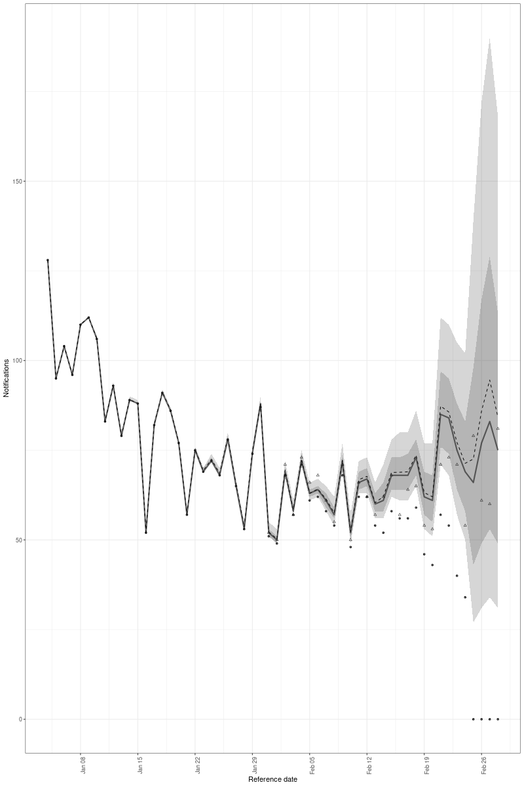

# Model Runs on Flu Data: Some Results

# Data

FluSurv-Net Data from 2023-2024 season

# Models

Running three models:

1. Model run on the flu data aggregated to weekly data, so both reference and report dates are observed with weekly resolution.

2. Model run on reporting cycle data. DOW fixed effect.

3. Model run on reporting cycle data. `not_report_day` fixed effect with non-reporting days hardcoded to approx zero hazard.

# Nowcast Plots

Model 2

# Running Time and Basic Diagnostics

Model 2 ran for 81 minutes and had 0 divergent transitions with a max_rhat of 1.

