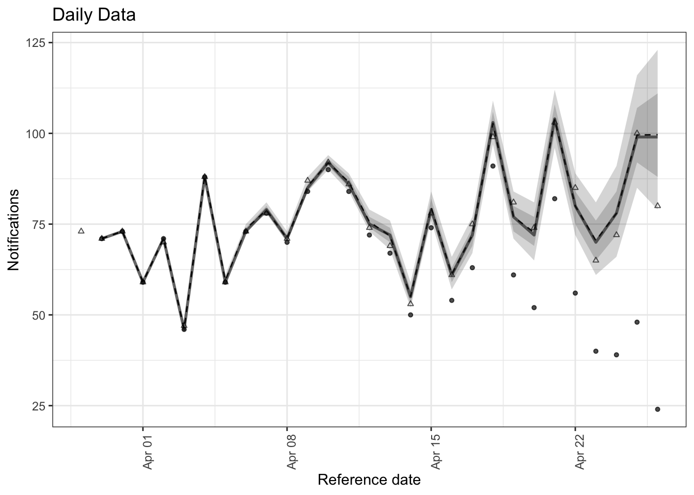
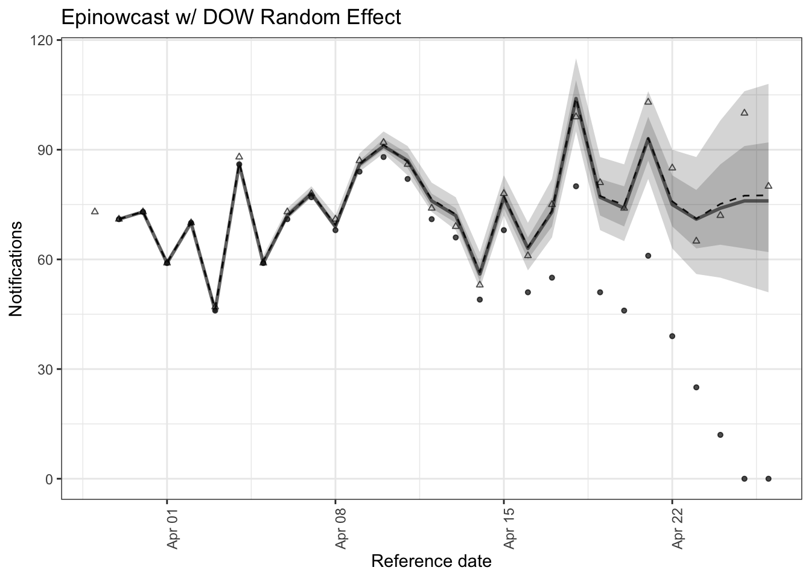
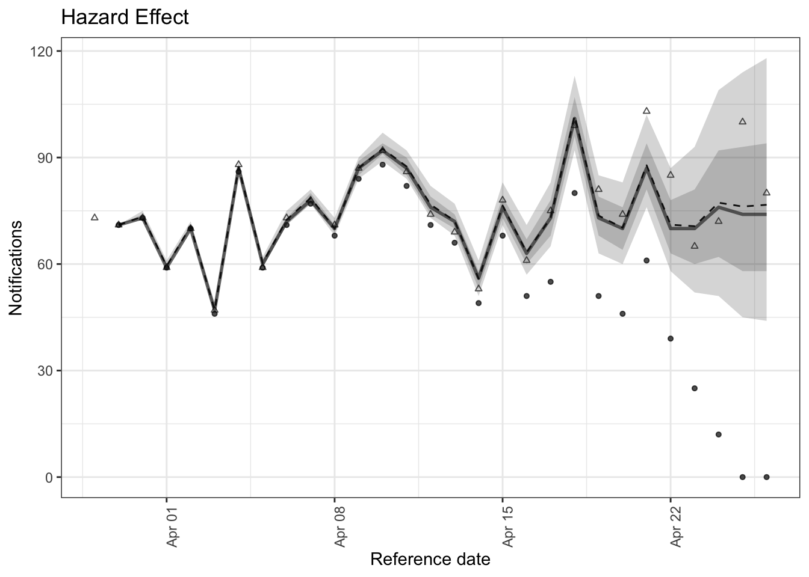
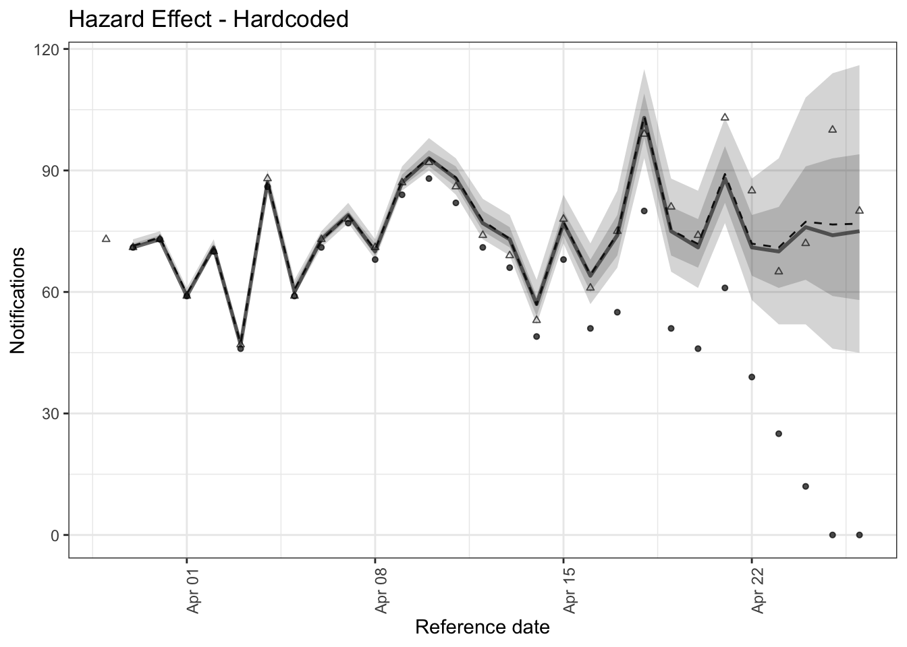
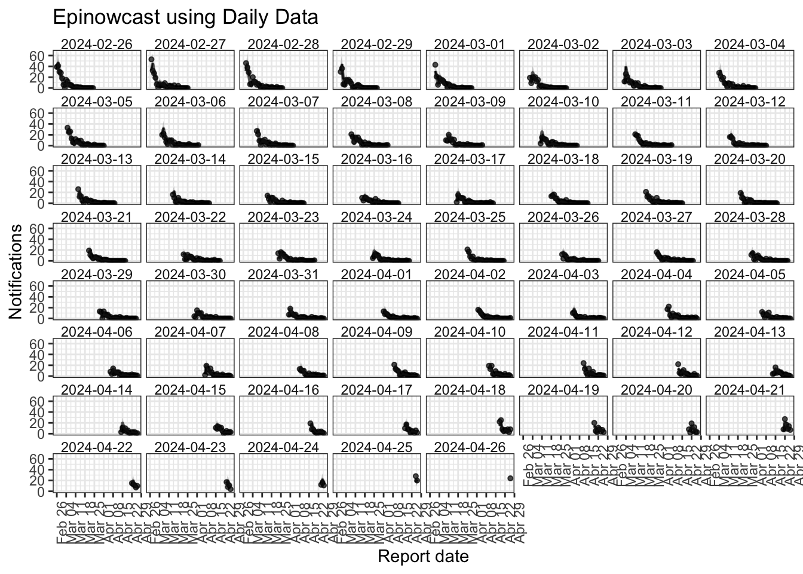
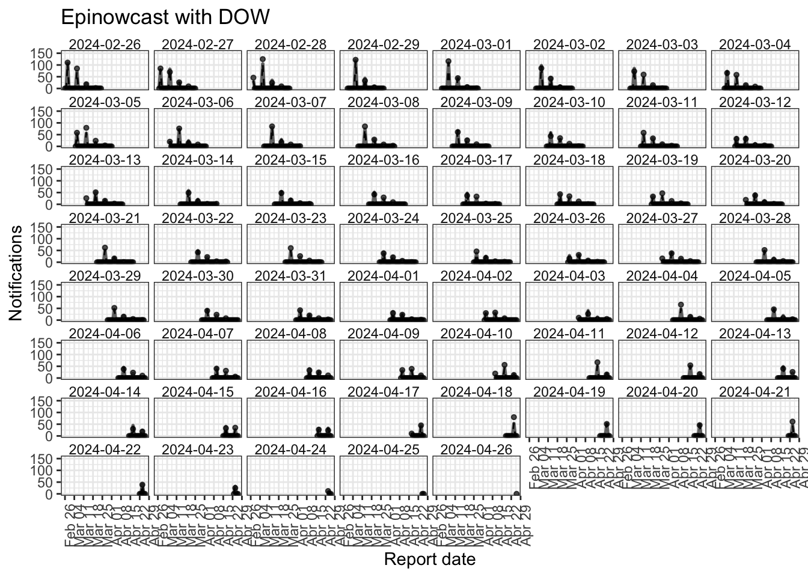
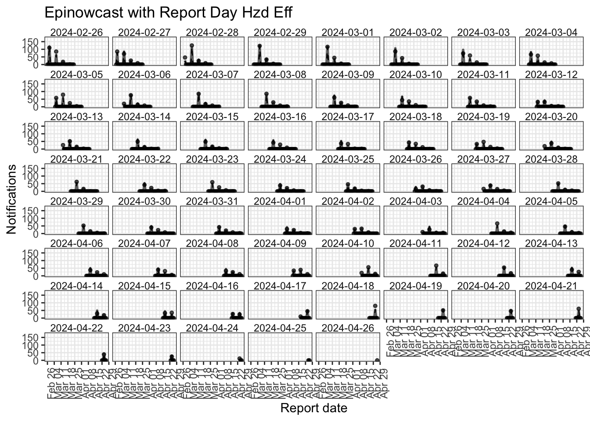

# Model Runs on Sim Data: Some Results

# Simulations

- Simulated from an SEIHRD model

- Added on a gamma hospital admission reporting delay

- Added DOW reporting effects (weekends have lower report probability)

# Models

Ran four models:

1. Model run on the actual daily data with daily reporting dates. DOW random effect.

2. Model run on reporting cycle data. DOW random effect.

3. Model run on reporting cycle data. `not_report_day` fixed effect.

4. Model run on reporting cycle data. `not_report_day` fixed effect with non-reporting days hardcoded to approx zero hazard.

# Nowcast Plots

Model 1:

Model 2:

Model 3:

Model 4:

# Running Time and Basic Diagnostics

1. The model using Epinowcast with daily data ran for 37 minutes. It had 8 divergent transitions and a max rhat of 1.

2. The model using Epinowcast with a reporting DOW random effect 22 minutes. It had 11 divergent transitions and a max rhat of 1.

3. The model using Epinowcast with a hazard effect corresponding to the reporting cycle day ran for 104 minutes. It had 0 divergent transitions and a max rhat of 1.04.

4. The model using Epinowcast with hardcoded hazard effects ran for 29 minutes. It had 8 divergent transitions and a max rhat of 1.

# Posterior Predictive

Model 1:

Model 2:

Model 3:

Model 4:

