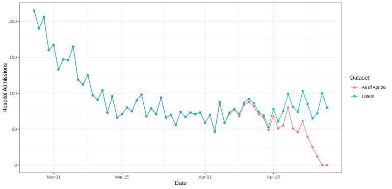
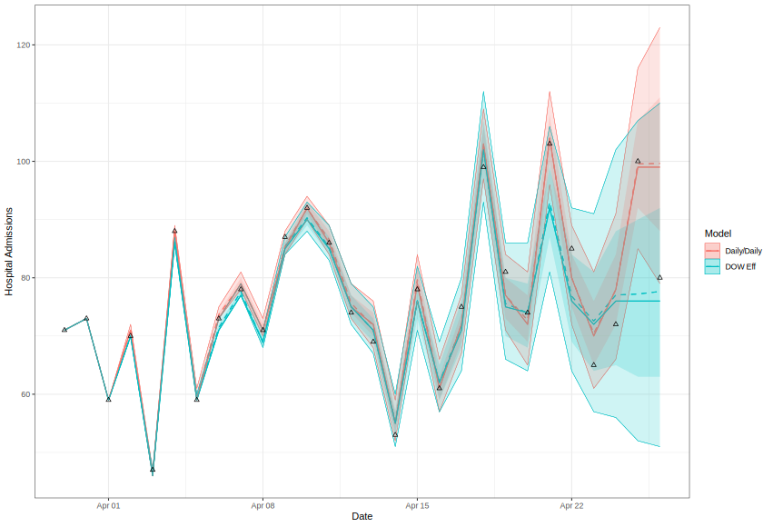
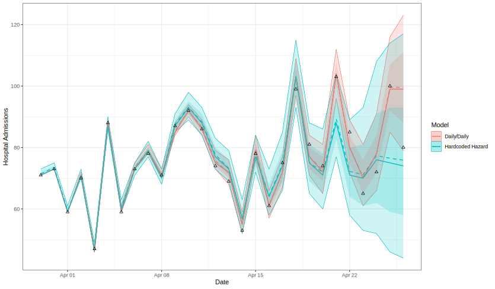
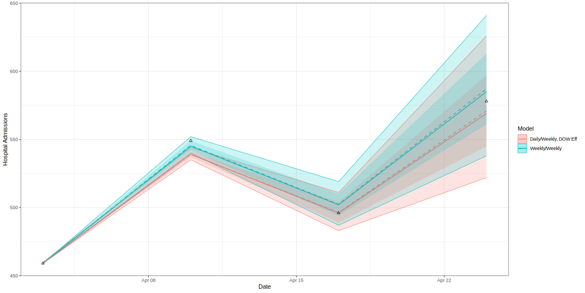
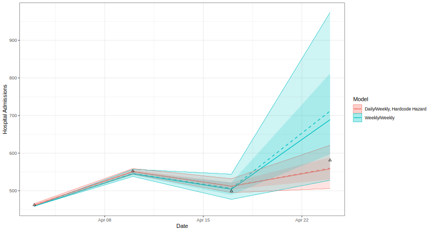
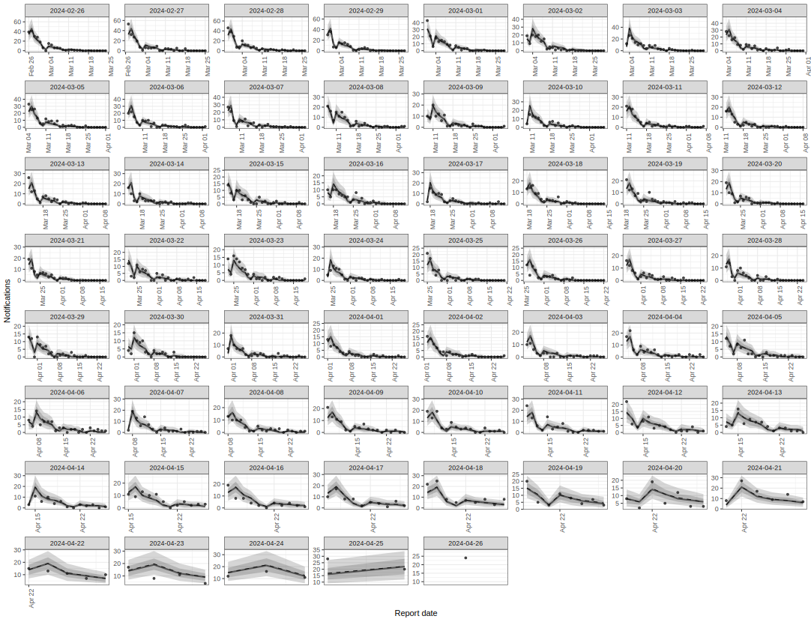
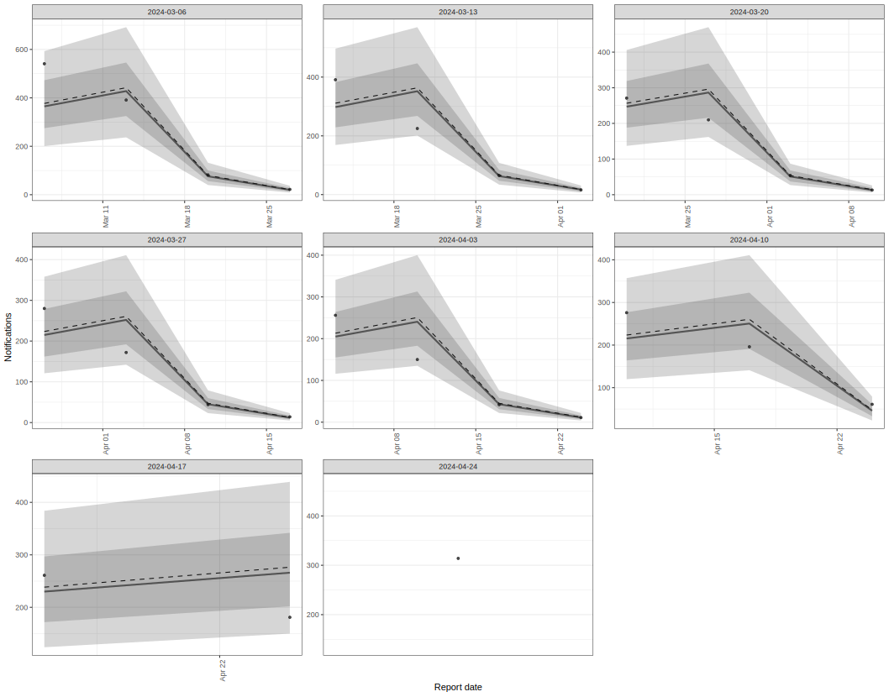
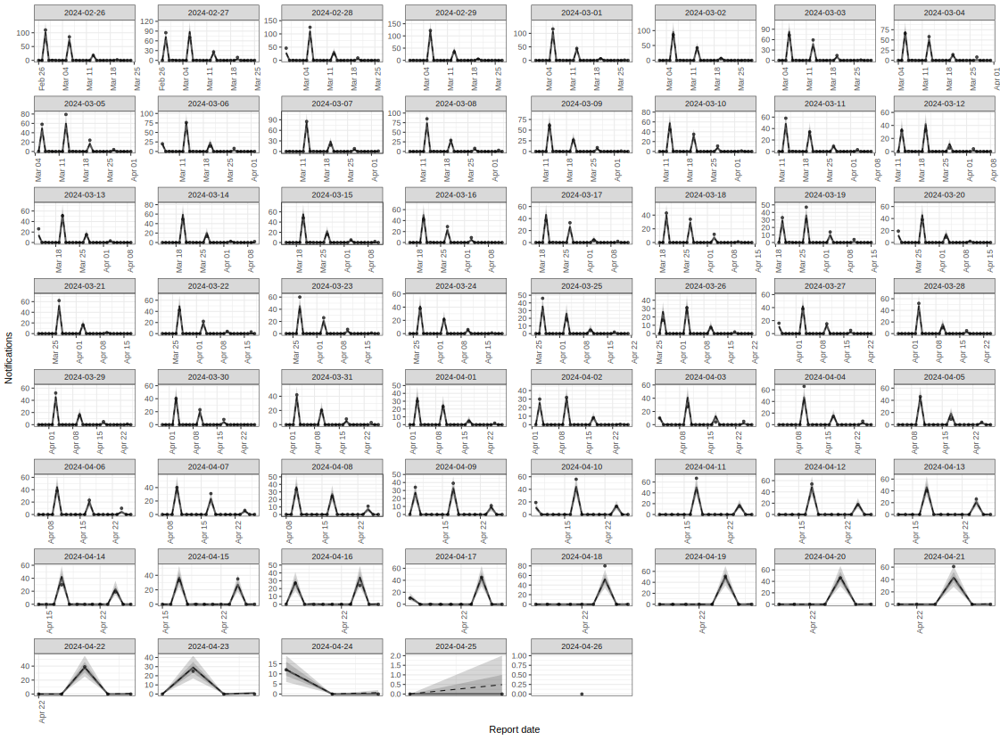
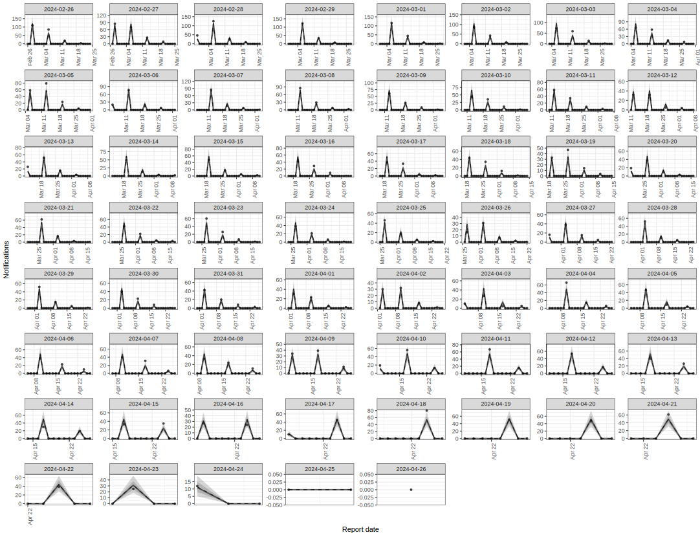

# Model Runs on Sim Data: Some Results

# Simulations

- Simulated from an SEIHRD model

- Added on a gamma hospital admission reporting delay

- Added DOW reporting effects (weekends have lower report probability)

# Models

Ran four models:

1. Model run on the actual daily data with daily reporting dates. DOW fixed effect.

2. Model run on the simulated data aggregated to weekly data, so both reference and report dates are observed with weekly resolution.

3. Model run on reporting cycle data. DOW fixed effect.

4. Model run on reporting cycle data. `not_report_day` fixed effect with non-reporting days hardcoded to approx zero hazard.

# Nowcast Plots

## Daily Resolution

Model 1 vs. Model 3:

Model 1 vs. Model 4:

## Weekly Resolution

Model 2 vs. Model 3:

Model 2 vs. Model 4:

# Running Time and Basic Diagnostics

All models were run with 2 chains of 3000 samples each, 1/3 of these are warmup.

Model 1 ran for 37 minutes and had 8 divergent transitions with a max_rhat of 1.

Model 2 ran for 19 seconds and had 2 divergent transitions with a max_rhat of 1.

Model 3 ran for 29 minutes and had 0 divergent transitions with a max_rhat of 1.

Model 4 ran for 27 and had 0 divergent transitions with a max_rhat of 1.

# Posterior Predictions

Model 1

Model 2

Model 3

Model 4
